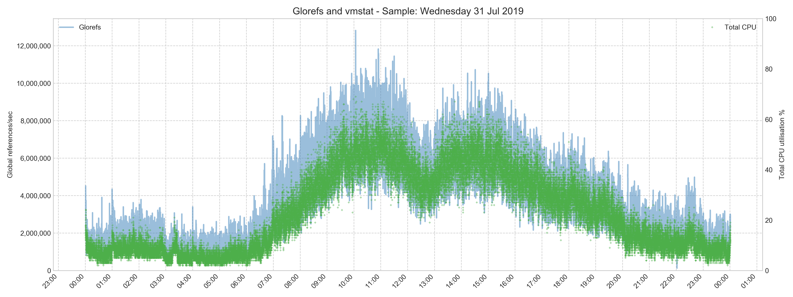
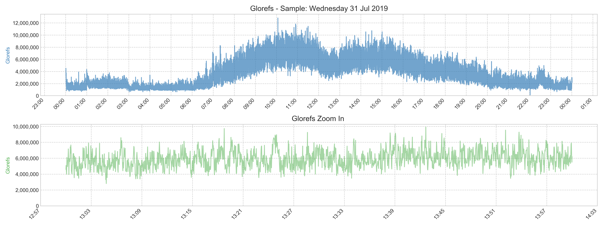
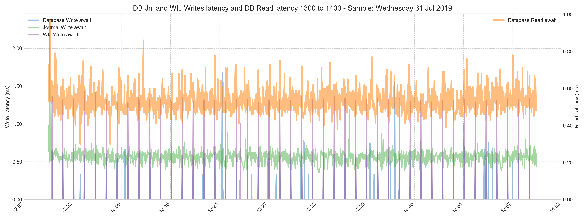

# MUT - Murray's Unsupported Tools

A place to share my noodlings and helper tools. Most are orientated around my work unpacking and vsiualising system performance data. Just a big bag to store my stuff. If you find them useful, great!

As the title says. These tools are not supported, but suggestions, tips, fixes!, and any other comments welcome.  

> As Abraham Maslow said in 1966, "I suppose it is tempting, if the only tool you have is a hammer, to treat everything as if it were a nail." My current favorite tool for everything is Python, so you will see a lot of that here -- as I learn Python -- so code is bound to be not best practice.

Current Python Version;

	python --version
	Python 3.7.3
	
For safety you can use a docker container (instructions below)	

<hr>

## Manipulating csv files

Many of the tools in this section are built to further process csv files output from [yape](https://github.com/murrayo/yape), but they could be bent to other uses. The date+time indexed csv files include; mgstat, vmstat, and iostat. Ultimately the plan is for standalone functionality in these scripts will be included in yape.

`yape_deep.sh`
- This script loops through multiple subdirectories to run yape and collate results, importantly it sorts csv files to a folder so its easy to run the csv processing scripts below.

`iris_resample_csv.py`
- Refactor set of timestamped csv files so that all times are in synch. This is useful if you run iris\_combine\_csv.py to merge csv files, eg mgstat, vmstat, and iostat into a super csv file for further processing.

`iris_combine_csv.py`
- Build a master list of dataframes for each csv file. This is nice because you dont' care whether its 2 or 20. Then merge them (left inner) to create a single date+time indexed csv files with metrics across the row. If you have a 1 second tick on your vmstat and iostat etc then the merge will be OK, if you are using longer ticks like 5 or 10 seconds then there coulld be drift, so use iris\_resample\_csv.py to line up the times first (using the hammer).

`TrakCare_Monitor.py`
- Quickly process TrakCare Monitor Data to collate and visualise some interesting metrics. Source data must be exported from the TrakCare Monitor Tool using "ExportAll".

<hr>

## Pretty pButtons Charts

The script `pretty_pButtons.py` uses the sqlite database created when using [yape](https://github.com/murrayo/yape) to make charts that can combine metrics for **Red Hat** (RHEL): vmstat, iostat and mgstat.
For example, this is handy if you need to output charts for performance reports. This is a preview of the functionality, working towards an interactive solution.

There is also an option to output merged vmstat, iostat and mgstat as a csv file for you to work with in other ways.

Formatting and chart creation is driven from two yml files, I have included samples;

- `pretty_pButtons_input.yml` - instance details such as name and key disks,
- `pretty_pButtons_chart.yml` - Attributes of charts to produce.

The workflow is;

**A. Create sqlite file using [yape](https://github.com/murrayo/yape)**

Hint: use default plots to see what it is you want to look at at or deep dive in to.

`yape --mgstat --vmstat --iostat --filedb myfile.sqlite3 pButtonsHTMLfilename.html`

If you already know what columns you care about, you can simply run yape to only create the sqlite file.

`yape --filedb myfile.sqlite3 pButtonsHTMLfilename.html`

**B. Edit `pretty_pButtons_input.yml` and  `pretty_pButtons_chart.yml`** 

You will need the disk /dev names for Database, Primary and Alternate Journal, WIJ, and Caché/IRIS disk. They can all be the same device if that is how you system is set up. 
See the notes below for changing the defaults for `pretty_pButtons_chart.yml`.

**C. Run the script**

Here is an example using optional flags to start the zoom charts at 10:00 and end at 11:00:

`pretty_pButtons.py -f myfile.sqlite3 -s 10:00 -e 11:00 -p pretty_pButtons_input.yml -i -m -c pretty_pButtons_chart.yml -o ./pretty`

_**NOTE: There is very little error checking in the script**_

To see all the options:

`pretty_pButtons.py --help`

### Notes on `pretty_pButtons_input.yml`

The following example shows site specific and global chart attributes in yml format.

```
Site Name: "- Customer Name"
Disk List:
    Database: "sdd"
    Primary Journal: "sdj1"
    Alternate Journal: "sdk1"
    WIJ: "sdb1"
    IRIS: "dm-7"
Colormap Name: "Set1"
DPI: 300
WIDTH: 16
HEIGHT: 6
MEDIAN: False
Moving Average: 60
```

_Site Name_ : Is text that appears in the title of all charts, and is also used as part of the file name. 

_Disk List_ : Section is unique to your site. Use the last part of the device name. e.g.: `/dev/sde` is `sde`, `/dev/dm-5` is `dm-5` etc. 

_Colormap Name_ : Do not change

_DPI_ : Chart dots per inch, 300 is print level quality, 80 is fine for screens.

_WIDTH_ : Chart width in inches.

_HEIGHT_ : Chart height in inches.

_MEDIAN_ : Do not change.

_Moving Average_ : Do not change.

### Notes on `pretty_pButtons_chart.yml`

The following example shows a chart description in yml format. The chart combines Glorefs from mgstat with Total CPU from vmstat.
There can be as many chart descriptions as you want in a single .yml file.

```
Glorefs and vmstat:  
    Title: "Glorefs and vmstat"
    columns_to_show:
        column1: {"Text": "Glorefs", "Name": "Glorefs_mg", "axis": "left", "Style": "-", "Linewidth": 2, "Markerstyle": "", "Markersize": 1 }
        column2: {"Text": "Total CPU", "Name": "Total CPU_vm", "axis": "right", "Style": "", "Linewidth": 2, "Markerstyle": "+", "Markersize": 3 }   
    zoom: False
    y_label_l: "Global references/sec"
    y_label_r: "Total CPU utilisation %"  
    y_max_l: 0
    y_max_r: 100           
```    

_Title_ : text appears in the title area of the chart, and is also used as part of the file name. 

_Columns to show_ : section lists each plot line, there is no hard limit on the number of lines (see **Column names** below). 

_column#_ : This section, one per plot line, lists pairs of keys with attributes. Attributes are:
- _Text_ : Legend for the plot line.
- _Name_ : Column name from the sqlite database.
- _axis_ : y axis; left or right
- _Style_ : blank ("") if a marker, eg a dot or triangle etc will be used, else one of these [Styles](https://matplotlib.org/gallery/lines_bars_and_markers/line_styles_reference.html).
- _Linewidth_ : if a line style, the width.
- _Markerstyle_ : if _Style_ is "" the [marker style](https://matplotlib.org/api/markers_api.html?highlight=marker%20style).
- _Markersize_ : If marker is used the size.

_zoom_ : if True, the chart x axis will limited to times specified in the command line time selection options `-s` and `-e`.

_ylabel\_l_ : The left hand side y label.

_ylabel\_r_ : The right hand side y label.

_y\_max\_l_ : Maximum y axis left, e.g. 100 if you are showing %. 0 for max(). All charts start at 0. 

_y\_max\_r_ : Maximum y axis right.

**Column names**

Column names are derived from **\_mg**stat, **\_vm**stat, and the disk types in `pretty_pButtons_input.yml`, for example;

- **\_db** is  Database metrics columns.
- **\_pri** is Primary journal metrics.
- **\_wij** is WIJ metrics.
- **\_mg** is mgstat.
- **\_vm** is vmstat.
  
The full list is:

```
datetime,rrqm/s_db,wrqm/s_db,r/s_db,w/s_db,rkB/s_db,wkB/s_db,avgrq-sz_db,avgqu-sz_db,await_db,r_await_db,w_await_db,svctm_db,%util_db,rrqm/s_pri,wrqm/s_pri,r/s_pri,w/s_pri,rkB/s_pri,wkB/s_pri,avgrq-sz_pri,avgqu-sz_pri,await_pri,r_await_pri,w_await_pri,svctm_pri,%util_pri,rrqm/s_wij,wrqm/s_wij,r/s_wij,w/s_wij,rkB/s_wij,wkB/s_wij,avgrq-sz_wij,avgqu-sz_wij,await_wij,r_await_wij,w_await_wij,svctm_wij,%util_wij,Glorefs_mg,RemGrefs_mg,GRratio_mg,PhyRds_mg,Rdratio_mg,Gloupds_mg,RemGupds_mg,Rourefs_mg,RemRrefs_mg,RouLaS_mg,RemRLaS_mg,PhyWrs_mg,WDQsz_mg,WDtmpq_mg,WDphase_mg,WIJwri_mg,RouCMs_mg,Jrnwrts_mg,ActECP_mg,Addblk_mg,PrgBufL_mg,PrgSrvR_mg,BytSnt_mg,BytRcd_mg,WDpass_mg,IJUcnt_mg,IJULock_mg,PPGrefs_mg,PPGupds_mg,r_vm,b_vm,swpd_vm,free_vm,buff_vm,cache_vm,si_vm,so_vm,bi_vm,bo_vm,in_vm,cs_vm,us_vm,sy_vm,id_vm,wa_vm,st_vm,Total CPU_vm
```

In the example above columns plotted are:

- "Glorefs\_mg" (Glorefs from mgstat)
- "Total CPU\_vm" (Total CPU from vmstat)

<hr>

### Sample pretty_pButtons charts

Below is the example custom chart, Glorefs and vmstat, and a few of the included charts from the -m and -i flags. The last image is also a custom chart from the sample yml file.





_1300_1400.png)



<hr>

## Build docker image to run Python scripts

Docker file is included, you must have docker installed already
NOTE: the container is for Python scripts only, for example yape\_deep.sh cannot be run

```
$ docker build -t mut .
```
Check exists

```
$ docker image ls
REPOSITORY          TAG                 IMAGE ID            CREATED              SIZE
mut                 latest              e640c19160be        About a minute ago   1.1GB    
```

Run a script with included sample data

```
$ docker run -v `pwd`/INPUT:/data  --rm --name muttly mut  \
> ./iris_combine_csv.py -d /data
```

A file `all_csv.csv` will be created in folder `./INPUT`


    